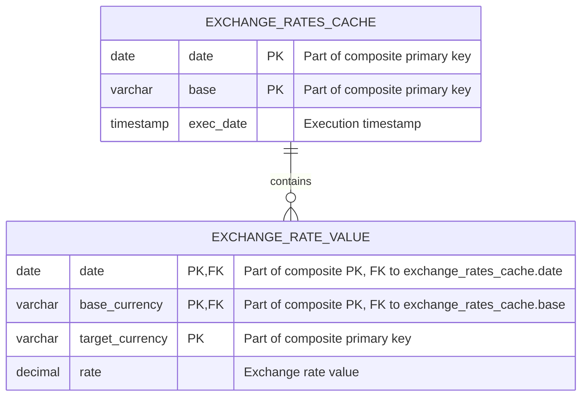
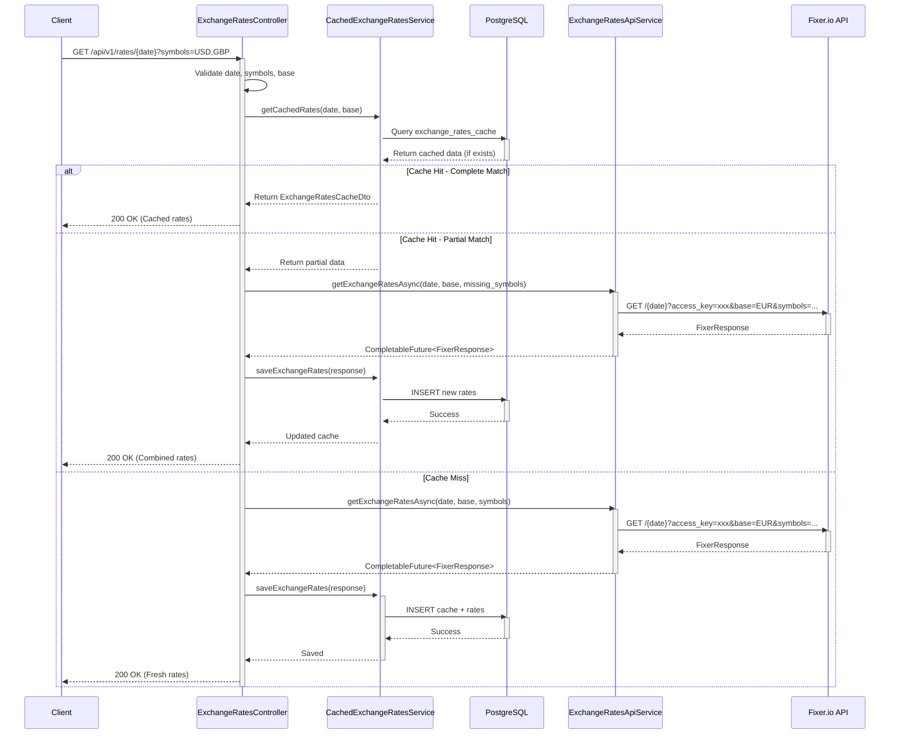
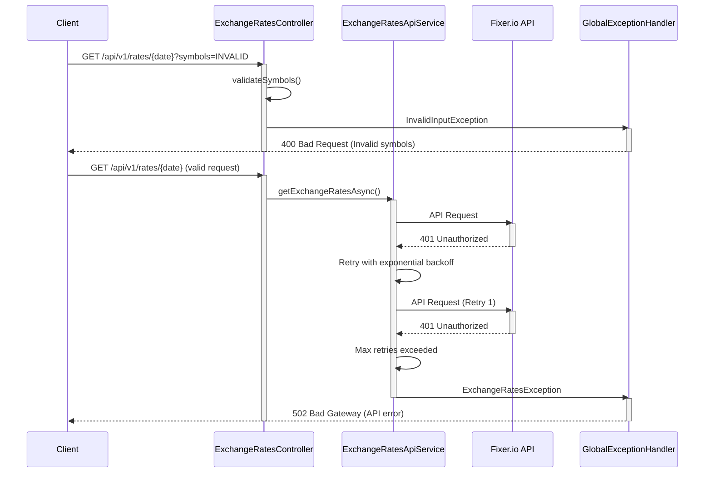

# Testing day application

## Table of Contents

- [Requirements](#requirements)
- [Quick Start](#quick-start)
  - [Local Development](#local-development)
  - [Docker Deployment](#docker-deployment)
- [Schema](#schema)
  - [Database ER Diagram](#database-er-diagram)
  - [Tables Description](#tables-description)
- [API Flow](#api-flow)
  - [Sequence Diagram - Exchange Rates Retrieval](#sequence-diagram---exchange-rates-retrieval)
  - [Error Handling Flow](#error-handling-flow)
- [Code Organization](#code-organization)
- [Architecture - Layered Design](#architecture---layered-design)
  - [Layer Responsibilities](#layer-responsibilities)
    - [1. Presentation Layer](#1-presentation-layer-controllers--validators)
    - [2. Business Logic Layer](#2-business-logic-layer-services-dtos-mappers)
    - [3. Integration Layer](#3-integration-layer-external-api-services)
    - [4. Data Access Layer](#4-data-access-layer-repositories--entities)
    - [5. Cross-Cutting Concerns](#5-cross-cutting-concerns)
  - [Data Flow Example](#data-flow-example)
  - [Benefits of This Architecture](#benefits-of-this-architecture)
- [Package Structure and Classes](#package-structure-and-classes)
  - [Main Application](#main-application)
  - [Controllers](#controllers)
  - [Services](#services)
  - [Entities (JPA/Hibernate)](#entities-jpahibernate)
  - [Repositories](#repositories)
  - [DTOs (Data Transfer Objects)](#dtos-data-transfer-objects)
  - [External API Models](#external-api-models)
  - [Mappers](#mappers)
  - [Validators](#validators)
  - [Exceptions](#exceptions)

---

## Requirements


* Use https://fixer.io/ as exchange rates source
* Register a new account for development and testing on your personal email
* Base currency is USD
* Response shape of /api/v1/rates/{day} should be similar to what https://fixer.io/documentation responds
* Use PostgreSQL to store the cached exchange rates
* Start a local database for development using docker-compose up -d database
* You can use whatever libraries you may need
* If you have experience with Hibernate, please use it to demonstrate your knowledge
* The service will be used only internally, so securing the API is not needed
* Prioritize making the code testable, don’t spend too much time writing tests for everything at the expense of other requirements. But if you want and have time for it, you can write a test or two.
* Think of edge cases that can occur in this environment and design solid error handling so that the downstream services can be simplified as much as reasonably possible.
* See test.sh for example requests


## Quick Start

### Local Development

**Prerequisites:**
- Java 17
- Maven 3.8+
- Docker (for PostgreSQL)
- Fixer.io API key

**Steps:**
```bash
# 1. Start PostgreSQL
make postgres-up

# 2. Wait for database to initialize
sleep 5

# 3. Run application with hot reload
make dev

# 4. Test the API
curl "http://localhost:8080/api/v1/rates/2024-01-15?symbols=USD,GBP,CAD"
```

### Docker Deployment

**Prerequisites:**
- Docker 20.10+
- Docker Compose 1.29+
- Fixer.io API key

**Quick Start:**
```bash
# 1. Set your API key
export FIXER_API_KEY=your_fixer_api_key_here

# 2. Start all services (database + application)
make docker-up

# 3. Check logs
make docker-logs

# 4. Test the API
curl "http://localhost:8080/api/v1/rates/2024-01-15?symbols=USD,GBP,CAD"

# 5. Stop all services
make docker-down
```

**Alternative using docker-compose directly:**
```bash
docker-compose up -d
docker-compose logs -f app
docker-compose down
```


## Schema

### Database ER Diagram



### Tables Description

**exchange_rates_cache**
- `date` (date, part of primary key)
- `base` (varchar, part of primary key)
- `exec_date` (timestamp)

**exchange_rate_value**
- `date` (date, part of primary key, foreign key to exchange_rates_cache.date)
- `base_currency` (varchar, part of primary key, foreign key to exchange_rates_cache.base)
- `target_currency` (varchar, part of primary key)
- `rate` (decimal)
- composite primary key (date, base_currency, target_currency)

## API Flow

### Sequence Diagram - Exchange Rates Retrieval



### Error Handling Flow




## Code organization
* Use Java and Spring Boot
* Use Maven as build tool
* Use JPA/Hibernate for database access
* Use RestTemplate or WebClient to call external API


## Architecture - Layered Design

This application follows a **layered architecture** pattern with clear separation of concerns. Each layer has specific responsibilities and communicates with adjacent layers only. This design enhances maintainability, testability, and scalability.

### Layer Responsibilities

#### 1. **Presentation Layer** (Controllers & Validators)
**Purpose:** Handle HTTP requests/responses and input validation

**Components:**
- `ExchangeRatesController` - REST endpoints, request mapping, response formatting
- `ExchangeRatesExampleController` - Example/demo endpoints
- `GlobalExceptionHandler` - Centralized error handling and HTTP status mapping
- Validators (`ApiKeyValidator`, `DateValidator`, `SymbolValidator`) - Input validation

**Responsibilities:**
- Receive and validate HTTP requests
- Delegate business logic to **service** layer
- Format responses (success/error)
- Handle HTTP status codes
- No business logic or data access

**Communication:**
- **Receives from:** External clients via HTTP
- **Calls:** Service layer for business logic
- **Returns to:** Clients via HTTP responses

---

#### 2. **Business Logic Layer** (Services, DTOs, Mappers)
**Purpose:** Implement core business logic and orchestrate operations

**Components:**
- `CachedExchangeRatesService` - Cache management, decision logic for cache hits/misses
- `ExchangeRatesApiService` - External API orchestration, retry logic, rate limiting
- `ExchangeRatesWebClientService` - Alternative WebClient implementation
- DTOs (`ExchangeRatesCacheDto`, `ExchangeRateValueDto`) - Data transfer between layers
- Mappers (`ExchangeRatesCacheMapper`, `FixerResponseMapper`) - Transform data between representations

**Responsibilities:**
- Implement business rules (caching strategy, retry logic)
- Orchestrate operations across multiple components
- Transform data between different representations
- Handle asynchronous operations (CompletableFuture)
- Transaction management (@Transactional)
- No direct HTTP or database concerns

**Communication:**
- **Receives from:** Controller layer
- **Calls:** Repository layer (data access) and Integration layer (external APIs)
- **Returns to:** Controller layer (DTOs)

---

#### 3. **Integration Layer** (External API Services)
**Purpose:** Manage communication with external systems

**Components:**
- `ExchangeRatesApiService` - RestTemplate-based API client
- `ExchangeRatesWebClientService` - WebClient-based API client
- `FixerResponse` - Model for successful API responses
- `FixerErrorResponse` - Model for API error responses

**Responsibilities:**
- HTTP client configuration and execution
- External API authentication (API key management)
- Request/response mapping for external systems
- Retry mechanism and error handling
- Rate limiting and circuit breaking

**Communication:**
- **Receives from:** Service layer
- **Calls:** External APIs (Fixer.io)
- **Returns to:** Service layer (External models)

---

#### 4. **Data Access Layer** (Repositories & Entities)
**Purpose:** Manage database operations and object-relational mapping

**Components:**
- `ExchangeRatesCacheRepository` - CRUD operations for cache entries
- `ExchangeRateValueRepository` - CRUD operations for rate values
- `ExchangeRatesCache` - JPA entity mapping to `exchange_rates_cache` table
- `ExchangeRateValue` - JPA entity mapping to `exchange_rate_value` table
- Composite ID classes (`ExchangeRatesCacheId`, `ExchangeRateValueId`)

**Responsibilities:**
- Database queries (JPA/JPQL)
- Entity persistence and retrieval
- Database transaction management
- Object-relational mapping (ORM)
- No business logic

**Communication:**
- **Receives from:** Service layer
- **Calls:** Database (via JPA/Hibernate)
- **Returns to:** Service layer (Entities)

---

#### 5. **Cross-Cutting Concerns**

**Exception Handling:**
- Custom exceptions (`ExchangeRatesException`, `InvalidInputException`, `CachedRatesNotFoundException`)
- `GlobalExceptionHandler` - Centralized exception to HTTP response mapping
- `ErrorResponse` - Standardized error response format

**Validation:**
- Input validation at presentation layer
- Business rule validation at service layer
- Data integrity validation at entity level

---

### Data Flow Example

```
1. Client Request
   ↓
2. Controller (Presentation Layer)
   - Validate input parameters
   - Extract request data
   ↓
3. Service (Business Logic Layer)
   - Check cache in database (via Repository)
   - Determine if external API call needed
   - Orchestrate async operations
   ↓
4. Repository (Data Access Layer) + External API (Integration Layer)
   - Query database for cached data
   - Call Fixer.io API if cache miss
   ↓
5. Service (Business Logic Layer)
   - Merge results
   - Save to cache if needed
   - Map to DTO
   ↓
6. Controller (Presentation Layer)
   - Format response
   - Return HTTP response
   ↓
7. Client Response
```

### Benefits of This Architecture

✅ **Separation of Concerns** - Each layer has a single, well-defined responsibility
✅ **Testability** - Layers can be tested independently with mocks
✅ **Maintainability** - Changes in one layer don't affect others
✅ **Reusability** - Services and repositories can be reused across controllers
✅ **Flexibility** - Easy to swap implementations (e.g., RestTemplate ↔ WebClient)
✅ **Clear Dependencies** - Dependencies flow downward (Controller → Service → Repository)


## Package Structure and Classes

### Main Application
**Package:** `com.shipmonk.testingday`
- `TestingdayExchangeRatesApplication` - Spring Boot main application class

### Controllers
**Package:** `com.shipmonk.testingday.controller`
- `ExchangeRatesController` - Main REST controller for `/api/v1/rates/{date}` endpoint with caching logic
- `ExchangeRatesExampleController` - Example controller for demonstration purposes

### Services
**Package:** `com.shipmonk.testingday.service`
- `ExchangeRatesApiService` - Service for calling Fixer.io API using RestTemplate with retry mechanism and async support
- `ExchangeRatesWebClientService` - Alternative service implementation using WebClient
- `CachedExchangeRatesService` - Service managing exchange rates with database caching

### Entities (JPA/Hibernate)
**Package:** `com.shipmonk.testingday.entity`
- `ExchangeRatesCache` - Main cache entity storing exchange rate requests
- `ExchangeRatesCacheId` - Composite primary key for ExchangeRatesCache (date, base, exec_date)
- `ExchangeRateValue` - Entity storing individual exchange rate values
- `ExchangeRateValueId` - Composite primary key for ExchangeRateValue (cache_id, target_currency)

### Repositories
**Package:** `com.shipmonk.testingday.repository`
- `ExchangeRatesCacheRepository` - JPA repository for ExchangeRatesCache entity
- `ExchangeRateValueRepository` - JPA repository for ExchangeRateValue entity

### DTOs (Data Transfer Objects)
**Package:** `com.shipmonk.testingday.dto`
- `ExchangeRatesCacheDto` - DTO for exchange rates cache data
- `ExchangeRateValueDto` - DTO for individual exchange rate values
- `ExchangeRatesCacheMapper` - Mapper for converting between entities and DTOs

### External API Models
**Package:** `com.shipmonk.testingday.external`
- `FixerResponse` - Model for Fixer.io API success response
- `FixerErrorResponse` - Model for Fixer.io API error response

### Mappers
**Package:** `com.shipmonk.testingday.mapper`
- `FixerResponseMapper` - Mapper for converting Fixer.io responses to internal format

### Validators
**Package:** `com.shipmonk.testingday.validators`
- `ApiKeyValidator` - Validates API key and required inputs
- `DateValidator` - Validates date format and constraints
- `SymbolValidator` - Validates currency symbol parameters

### Exceptions
**Package:** `com.shipmonk.testingday.exception`
- `ExchangeRatesException` - Base exception for exchange rates errors
- `InvalidInputException` - Exception for invalid input parameters
- `CachedRatesNotFoundException` - Exception when cached rates are not found
- `ErrorResponse` - Model for error response structure
- `GlobalExceptionHandler` - Global exception handler for REST API
